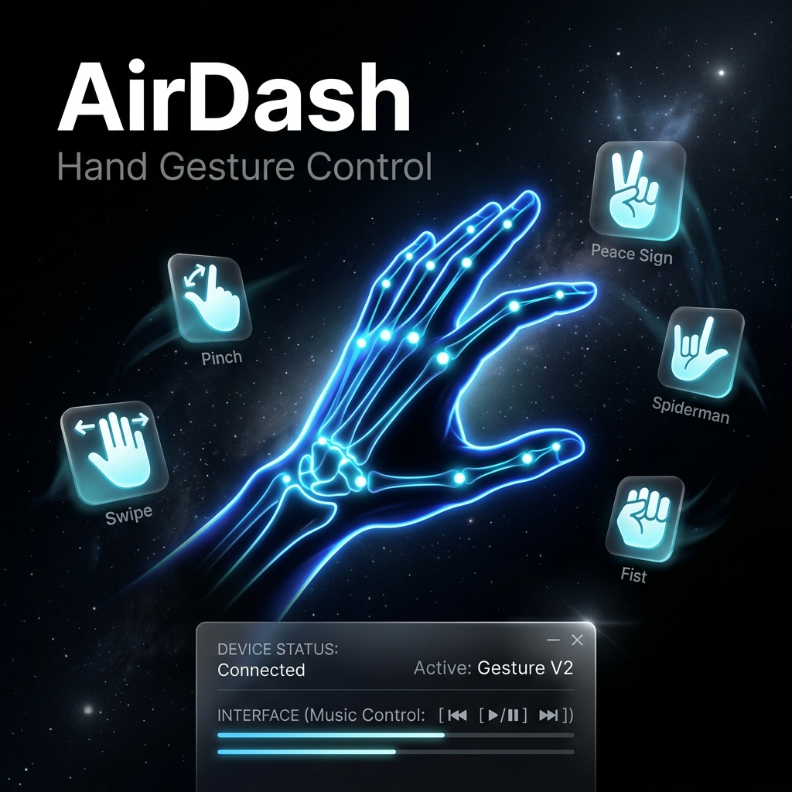

<div align="center">



# ✋ AirDash

### Hand Gesture Control System for Windows

*Control your entire computer with nothing but your hand — no touch, no clicks, just motion.*

[](https://www.python.org/)
[](https://doc.qt.io/qtforpython-6/)
[](https://mediapipe.dev/)
[](https://opencv.org/)
[](https://www.microsoft.com/windows)
[](LICENSE)

---

</div>

## 🌟 What is AirDash?

**AirDash** is a real-time, camera-based hand gesture control system for Windows. It uses your webcam and Google's MediaPipe AI to track your hand landmarks at up to 120 FPS, recognizes 10+ distinct gestures, and instantly maps them to keyboard shortcuts, mouse actions, or application launches — all without touching your keyboard or mouse.

Think of it as Iron Man's gesture suite, built for your desktop.

---

## ✨ Features

| Feature | Description |
|---|---|
| 🤖 **AI Hand Tracking** | MediaPipe-powered 21-landmark skeleton detection at up to 120 FPS |
| 👆 **10+ Built-in Gestures** | Pinch, Fist, Open Palm, Peace, Swipe L/R/U/D, Spiderman, Pinky & more |
| 🧩 **Custom Gesture Builder** | Design any hand pose with a live finger-state editor + camera preview |
| ⌨️ **Full Action Mapping** | Bind gestures to shortcuts, mouse clicks, right-clicks, or app launches |
| 🚀 **App Launcher** | Instantly open any installed app — auto-discovers 250+ apps from Windows registry |
| 🎨 **Themed Overlays** | Dr. Strange & Iron Man visual effects overlaid on the camera feed |
| ⚡ **GPU Acceleration** | Optional CUDA or OpenCL rendering pipeline for lower-latency frame processing |
| 📊 **Session Stats** | Live gesture count, action count, and uptime displayed in the footer |
| 🔁 **Gesture Hysteresis** | Smart stabilizer prevents false positives and rewarded repeated triggers |
| 🎛️ **FPS Control** | Choose 60 / 90 / 120 FPS or uncapped system-speed mode |
| 🖥️ **Fullscreen Mode** | Detach the camera feed to a dedicated fullscreen window |
| 💾 **Persistent Config** | All mappings auto-saved to `config/settings.json` |

---

## 🖐️ Gesture Reference

> All gestures are recognized in real time from your webcam feed.

| Icon | Gesture | How to Do It |
|------|---------|--------------|
| 🤏 | **Pinch** | Touch thumb tip to index fingertip |
| ✊ | **Closed Fist** | Close all fingers into a fist |
| 🤚 | **Open Palm** | Extend all 5 fingers outward |
| ✌️ | **Peace** | Raise index + middle fingers, curl rest |
| 🤙 | **Pinky Only** | Raise only the pinky finger |
| 🤟 | **Spiderman** | Raise index + pinky + thumb |
| ⬅️ | **Swipe Left** | Open palm, move hand to the left |
| ➡️ | **Swipe Right** | Open palm, move hand to the right |
| ⬆️ | **Swipe Up** | Open palm, move hand upward |
| ⬇️ | **Swipe Down** | Open palm, move hand downward |

### Default Bindings

| Gesture | Action |
|---------|--------|
| Pinch | Show Desktop (`Win + D`) |
| Swipe Left | Previous Track |
| Swipe Right | Next Track |
| Peace | Play / Pause Media |

---

## 📁 Project Structure

```
1.o/
│
├── main.py                    # Entry point — boots QApplication + MainWindow
│
├── core/                      # Backend intelligence
│   ├── vision_engine.py       # Camera loop, MediaPipe inference, GPU pipeline
│   ├── gesture_recognizer.py  # Landmark → gesture classifier with smoothing
│   └── action_mapper.py       # Gesture → action executor + config persistence
│
├── ui/                        # PySide6 frontend
│   ├── main_window.py         # Main app window + UiBridge signal relay
│   ├── constants.py           # Color palette, gesture/action metadata, app catalog
│   ├── dialogs.py             # Fullscreen camera, custom gesture builder dialogs
│   └── system_scanner.py      # Windows registry + Start Menu app discovery
│
├── config/
│   └── settings.json          # User gesture mappings + camera/visual settings
│
├── assets/
│   └── bg.png                 # UI background asset
│
└── tests/
    ├── test_black_theme.py
    └── test_remove_buttons.py
```

---

## 🧠 Architecture Overview

```
Webcam Feed (OpenCV)
        │
        ▼
  VisionEngine (Thread)
  ├── Frame flip + RGB convert (CPU / CUDA / OpenCL)
  ├── MediaPipe Hands.process() → 21 landmarks
  ├── GestureRecognizer.detect_gesture()
  │   ├── _finger_states()          ← per-finger up/curl classifier
  │   ├── _detect_swipe()           ← velocity + axis dominance check
  │   ├── _raw_detect()             ← pinch, fist, peace, spiderman…
  │   └── Temporal smoothing        ← deque + majority vote
  ├── _stabilize_gesture()          ← hysteresis + repeat-trigger logic
  ├── ActionMapper.execute_action() ← keyboard / mouse / launch
  └── Callbacks → UiBridge Signals → MainWindow (Qt thread-safe)
                                           │
                               ┌───────────┴────────────┐
                               │       PySide6 UI        │
                               │  ├─ Sidebar camera feed  │
                               │  ├─ Gesture status panel │
                               │  ├─ Active bindings list  │
                               │  ├─ Mapping card grid     │
                               │  └─ Footer stats bar      │
                               └────────────────────────┘
```

---

## 🗂️ Module Deep-Dive

### `core/vision_engine.py` — The Perception Layer

The heart of AirDash. Runs entirely in a daemon thread so it never blocks the UI.

| Method | Purpose |
|--------|---------|
| `__init__()` | Probes CUDA/OpenCL availability, sets up MediaPipe and callbacks |
| `_run()` | Main loop: opens camera, reads frames, runs inference, fires callbacks |
| `_stabilize_gesture()` | Hysteresis engine: requires N consecutive frames before confirming a gesture; prevents jitter |
| `_build_hand_snapshot()` | Extracts per-hand finger states + wrist position into a serializable dict |
| `_update_motion_history()` | Tracks wrist trajectory for left/right/up/down motion classification |
| `_detect_custom_gesture()` | Matches live hand state against user-defined custom gesture rules |
| `set_camera_index()` | Hot-swaps the camera mid-session safely (thread-locked) |
| `set_render_device()` | Switches between CPU / CUDA / OpenCL rendering on-the-fly |
| `set_target_fps()` | Enforces the frame rate cap via sleep-based timing |

**Theme Effects:**
- **Dr. Strange** — Draws concentric orange/gold circles around the palm center on Open Palm
- **Iron Man** — Draws a white core + cyan ring arc-reactor around the palm

---

### `core/gesture_recognizer.py` — The Intelligence Layer

A self-contained gesture classifier trained on geometric relationships between MediaPipe's 21 hand landmarks.

| Method | Purpose |
|--------|---------|
| `_palm_scale()` | Computes a wrist→MCP distance normalization factor for scale invariance |
| `_finger_states()` | Determines extended/curled state per finger using tip-pip-mcp distance hierarchy |
| `_detect_swipe()` | Uses a rolling 14-frame position history and axis-dominance ratio to detect directional swipes |
| `_raw_detect()` | Core classifier — returns `(gesture_name, confidence)` from landmark geometry |
| `detect_gesture()` | Wraps `_raw_detect` with temporal majority voting (7-frame deque) and hold hysteresis |

**Recognized Gestures:** Pinch, Closed Fist, Open Palm, Peace, Pinky Only, Spiderman, Swipe Left/Right/Up/Down

**Tunable Thresholds** (all in `__init__`):
```python
pinch_enter_thresh = 0.21    # normalized tip distance to enter pinch
pinch_exit_thresh  = 0.29    # distance to release pinch
swipe_dx_thresh    = 0.14    # min horizontal displacement for swipe
swipe_min_interval = 0.28    # seconds between successive swipes
stable_ratio       = 0.45    # fraction of recent frames needed for stability
```

---

### `core/action_mapper.py` — The Execution Layer

Translates confirmed gestures into system-level OS actions and manages persistent configuration.

| Method | Purpose |
|--------|---------|
| `execute_action()` | Runs the mapped action for a gesture (with per-gesture cooldown) |
| `add_mapping()` | Creates a new gesture binding + persists to `settings.json` |
| `delete_mapping()` | Removes a binding + persists |
| `trigger_gesture()` | Programmatically fires any gesture by name |
| `launch_app()` | Launches any app by friendly name using `os.startfile` + fallback `cmd /c start` |
| `close_app()` | Kills a running process by friendly name using `taskkill /F /IM` |
| `execute_raw()` | Directly fires shortcuts, types text, or adjusts system volume |
| `save_config()` | Writes current mappings back to `config/settings.json` |

**Action Types:**

| Type | What Happens |
|------|-------------|
| `shortcut` | Sends a key combination via `keyboard.send()` |
| `mouse_click` | Triggers a left mouse click via `pyautogui` |
| `mouse_right_click` | Triggers a right mouse click via `pyautogui` |
| `launch` | Opens an app or URL via `os.startfile` |

---

### `ui/main_window.py` — The Interface Layer

A 1549-line PySide6 application window with a clean sidebar + command center layout.

**Key Components:**

| Class / Method | Purpose |
|----------------|---------|
| `UiBridge` | Thread-safe Qt signal relay — translates VisionEngine callbacks to UI thread signals |
| `MainWindow.__init__()` | Wires vision engine, builds UI, starts camera, initializes stats timer |
| `_build_ui()` | Constructs the full two-column layout: sidebar (camera + status) + main panel (gestures) |
| `_apply_theme()` | Applies the full dark stylesheet with all component-specific QSS styles |
| `_animate_entry()` | Fades the window from opacity 0→1 on launch (400ms `OutCubic`) |
| `refresh_mappings()` | Rebuilds mapping cards + sidebar guide list from current `ActionMapper.mappings` |
| `_create_mapping_card()` | Builds an individual gesture card (icon + name + action + remove button) |
| `_on_gesture_ready()` | Updates gesture status panel + cooldown bar + action count when a gesture fires |
| `_on_frame_ready()` | Converts numpy RGB frames → `QPixmap` and renders to sidebar camera label |
| `toggle_camera()` | Pauses/resumes the vision engine camera + updates status badge |
| `toggle_camera_fullscreen()` | Opens/closes a `CameraFullscreenDialog` in fullscreen mode |
| `_refresh_camera_devices()` | Background-threads a camera scan and populates the camera selector dropdown |
| `open_inline_new_gesture()` | Switches center stack to the inline custom gesture builder |
| `_update_footer_stats()` | Ticks the session uptime display every second |

---

### `ui/system_scanner.py` — The App Discovery Layer

Discovers all launchable applications from Windows without relying on a hardcoded list.

**Scan Sources (in priority order):**
1. **Registry Uninstall Entries** — `HKLM/HKCU\SOFTWARE\...\Uninstall`
2. **App Paths Registry** — `SOFTWARE\Microsoft\Windows\CurrentVersion\App Paths`
3. **Start Menu Shortcuts** — `.lnk` files in `ProgramData` and `AppData`
4. **Windows App Aliases** — `%LOCALAPPDATA%\Microsoft\WindowsApps\*.exe`
5. **Program Files Scan** — Walks C:/D:/E: `Program Files` directories

**Camera Detection:**
- `_get_directshow_camera_names()` — Uses `pygrabber` for DirectShow device names
- `_discover_cameras()` — Probes indices 0–4 with read-frame validation
- `_get_preferred_start_camera()` — Ranks cameras (physical > virtual) for auto-selection

---

### `ui/constants.py` — The Design System

Centralizes all design tokens, gesture metadata, and app catalogs.

**Color Palette (Dark Theme):**
```python
CLR_BG         = "#050505"   # Near-black background
CLR_ACCENT     = "#2D2D2D"   # Dark grey actions
CLR_GREEN      = "#4ADE80"   # Active / success indicators
CLR_RED        = "#F87171"   # Remove / error indicators
CLR_ORANGE     = "#FBBF24"   # Connecting / warning state
CLR_WHITE      = "#F0F0F0"   # Primary text
```

**App Catalog:** 200+ pre-configured launchable apps across 9 categories:
`Browsers · Social & Chat · Media & Music · Productivity · Development · Gaming · System Tools · Windows Settings · Websites`

---

## 🚀 Getting Started

### Prerequisites

- **Windows 10 / 11**
- **Python 3.10+**
- A working **webcam**

### Installation

```bash
# 1. Clone the repository
git clone https://github.com/your-username/airdash.git
cd airdash

# 2. (Recommended) Create a virtual environment
python -m venv .venv
.venv\Scripts\activate

# 3. Install dependencies
pip install -r requirements.txt

# 4. Launch AirDash
python main.py
```

### Dependencies

```
mediapipe       # Hand landmark detection
opencv-python   # Camera capture + frame processing
PySide6         # Qt6-based UI framework
Pillow          # Image utilities
pyautogui       # Mouse control
keyboard        # Global keyboard shortcuts
numpy           # Numerical operations
pygrabber       # DirectShow camera name enumeration
comtypes        # Windows COM interface (used by pygrabber)
```

---

## ⚙️ Configuration

AirDash stores all settings in `config/settings.json`:

```json
{
  "visuals": {
    "show_feed": true,
    "theme": "Dr. Strange"
  },
  "camera": {
    "preferred_index": 0
  },
  "mappings": [
    {
      "id": "default-pinch",
      "gesture": "Pinch",
      "action_type": "shortcut",
      "keys": ["win", "d"],
      "description": "Show Desktop"
    }
  ]
}
```

Changes are written automatically whenever you add, edit, or delete a gesture binding from the UI.

---

## 🛠️ Creating a Custom Gesture

1. Click **"+ New Gesture"** in the Command Center header
2. In the Custom Gesture Builder:
   - Give your gesture a name
   - Choose which hand(s): `Any`, `Left`, `Right`, or `Both`
   - Toggle finger states (`Up` / `Down`) for each finger
   - Optionally set a motion direction (static, move, left, right…)
   - Watch the live camera preview to confirm detection
3. Click **Create** — the gesture appears in your mappings list immediately

---

## 📸 Screenshots

> The UI uses a deep black palette with subtle glassmorphic cards and a two-column layout.

**Main Window Layout:**
```
┌─────────────────┬──────────────────────────────────────┐
│   SIDEBAR       │         COMMAND CENTER               │
│                 │                                      │
│  [Camera Feed]  │  🤏 Pinch        ⌨ Win + D  [Remove]│
│                 │  ✌️ Peace        ⌨ Play/Pause        │
│  ● DETECTED     │  ⬅️ Swipe Left   ⌨ Prev Track        │
│  GESTURE        │  ➡️ Swipe Right  ⌨ Next Track        │
│  ─────────────  │                                      │
│  ACTIVE         │         [+ New Gesture]              │
│  BINDINGS       │                                      │
│  • Pinch → ...  │──── Gestures: 42 · Actions: 18 ─────│
└─────────────────┴──────────────────────────────────────┘
```

---

## 🧪 Tests

```bash
# Run all tests
python -m pytest tests/

# Individual test files
python -m pytest tests/test_black_theme.py
python -m pytest tests/test_remove_buttons.py
```

---

## 🤝 Contributing

Contributions are welcome! To add a new gesture:

1. Add the gesture name to `AVAILABLE_GESTURES` in `ui/constants.py`
2. Add an icon to `GESTURE_ICONS`
3. Add a description to `GESTURE_DESCRIPTIONS`
4. Implement detection logic in `GestureRecognizer._raw_detect()` in `core/gesture_recognizer.py`

To add a new action type:

1. Add it to `ACTION_TYPES` in `ui/constants.py`
2. Handle the type in `ActionMapper.execute_action()` in `core/action_mapper.py`

---

## 📄 License

This project is licensed under the **MIT License** — see the [LICENSE](LICENSE) file for details.

---

<div align="center">

Made with ✋ and Python

*AirDash — Because keyboards are so last century.*

</div>
